<p align="center">
  <a href="https://ollysalanson.github.io/escape-from-pallet-town-web/">
    
  </a>
</p>

<p align="center">
  <b>Kanto, but it's a heist.</b><br>
  Drop into a town with five minutes on the clock, grab everything that isn't nailed down, and get
  out before time runs out or your rival catches up. Whatever you carry out is yours. Whatever you
  don't... well. Blue says thanks.
</p>

<p align="center">
  <a href="https://ollysalanson.github.io/escape-from-pallet-town-web/"></a>
  
  
  
</p>

<p align="center">
  <a href="#the-idea-in-one-breath">The idea</a> ·
  <a href="#how-a-raid-goes">How a raid goes</a> ·
  <a href="#home-sweet-harbour">Home</a> ·
  <a href="#the-cast">The cast</a> ·
  <a href="#draw-your-own-map">Make a map</a> ·
  <a href="#controls">Controls</a> ·
  <a href="#run-it-on-your-own-machine">Run it locally</a>
</p>

---

## The idea in one breath

**Escape from Pallet Town** is a Pokémon-flavoured *extraction* game that runs in your browser. You
never played an extraction game? Lucky you, here is the whole genre in five words:

| Word | What it means |
|---|---|
| **Raid** | One trip out into the world, on a five-minute clock. |
| **Extraction** | Walking out through an exit before the clock hits zero. It is the only way to keep anything. |
| **Stash** | Everything you own back home: your Pokémon, your supplies, your loot. |
| **Wipe** | Losing a raid, because your last Pokémon fainted or the clock ran out. The pack goes, with everything in it. |
| **Secure container** | One small pocket a wipe can't touch. Choose wisely. |

That's it. Go out, get greedy, come home. Or don't come home, and learn something about greed.

<p align="center">
  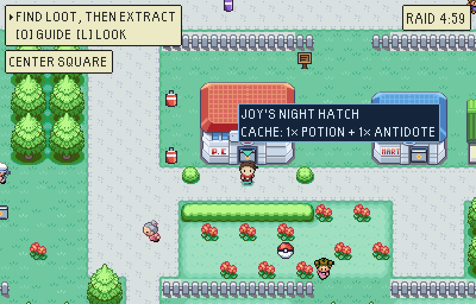
</p>

## How a raid goes

### 1. Kit up at Oak's Lab

Pick who comes with you and what goes in the pack. Everything you take is at risk, which is the
point: a Potion in the pack is a Potion you might lose, and a Potion left at home is a fight you
might lose instead. The pack is a grid of squares, not a list, so a Super Potion and a crate of
parts are fighting for the same space.

<p align="center">
  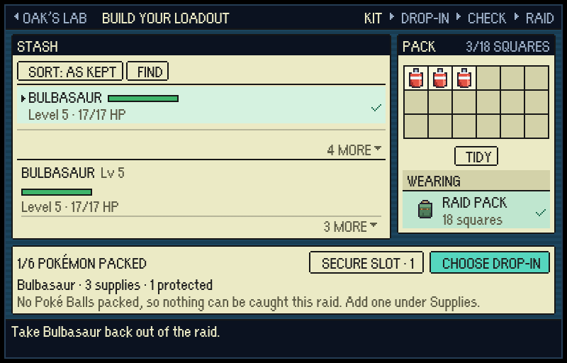
</p>

### 2. Drop in, and the clock starts

Five maps, each drawn tile by tile, each far bigger than one raid can cover, so there is always
somewhere you didn't get to. Tall grass rolls wild encounters. Landmarks hide caches. Contracts
from the board send you looking for something specific. Somewhere on the map there is a prize,
glinting, that is definitely worth the detour. Probably.

<p align="center">
  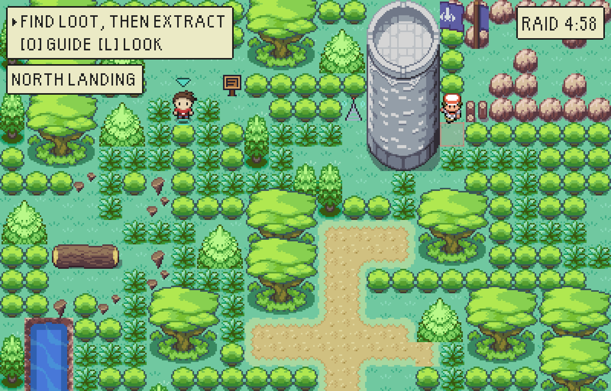
</p>

### 3. Somebody's coming

Every raid, one of five rivals is sent after you, and you'll know about it. They bring one Pokémon
for each of yours that can still fight, a few levels below it. Walking into them, or letting them
walk into you, means a fight. Running away always works, but costs you a chunk of the clock, so a
raid that runs from everything ends up running out of time instead.

<p align="center">
  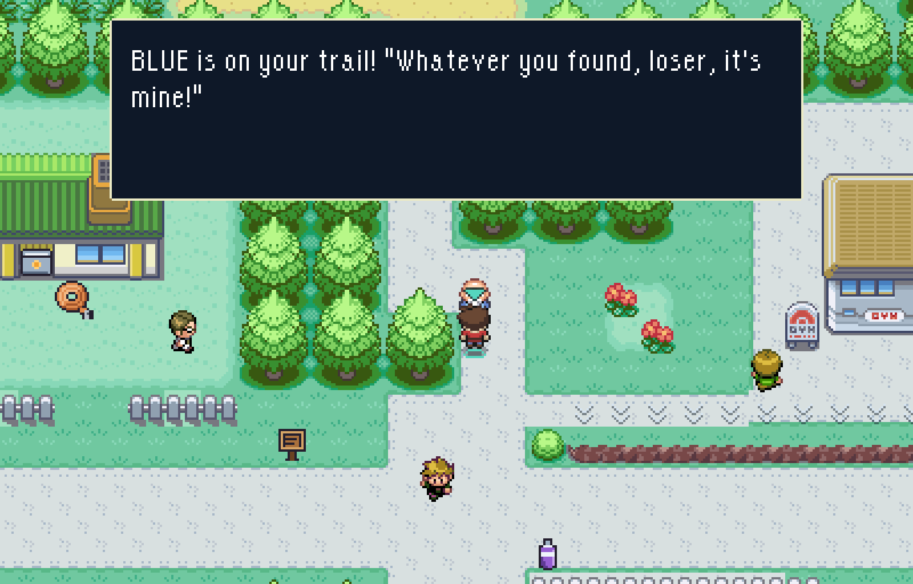
</p>

### 4. Fight like it's 2004

Battles play by Gen III rules, the FireRed and LeafGreen ones: their stats, their learnsets,
their seventeen types, abilities, weather, status, catching odds and experience. The roster is
Kanto's original 151. Catch something good in a raid and it rides home in your pack, where it
takes up squares like everything else: four for a first-stage Pokémon, six once it has evolved,
nine for a final form. Catching is a packing decision now. Sorry.

<p align="center">
  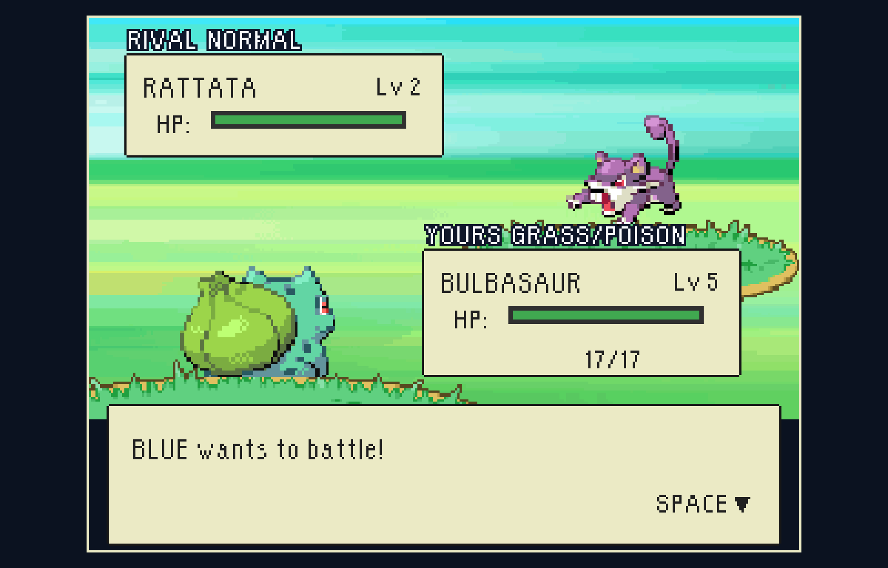
</p>

### 5. Get out (or don't)

Make it to an exit and everything you carried is banked for good. Go down instead and the pack is
gone, along with every Pokémon you brought that wasn't tucked into the secure container. The
result screen is very polite about it either way.

<p align="center">
  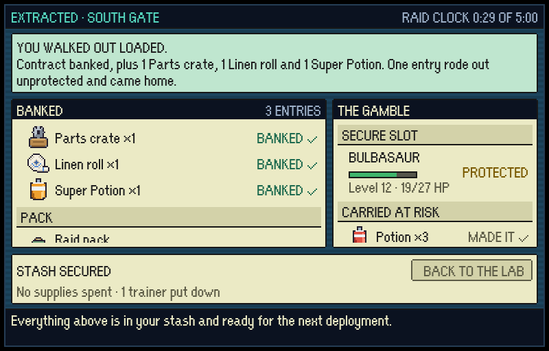
  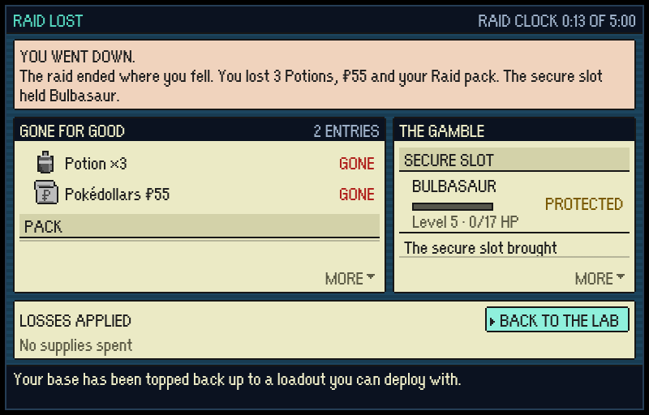
</p>

<p align="center"><sub>You'll never be left with nothing, mind. Lose everything and the base quietly tops you back up to a kit you can deploy with.</sub></p>

## Your pack is a puzzle

Every item takes a different number of squares, so a good raid is the one where the pack runs
out before the map does. Lay it out however you like: pick a piece up, carry it, turn it with
<kbd>R</kbd>, put it down, and it stays where you put it, raid after raid. There are four packs,
from a twelve-square Satchel to a thirty-square Hauler frame, and the one you're wearing is lost,
with everything in it, if you don't make it home.

<p align="center">
  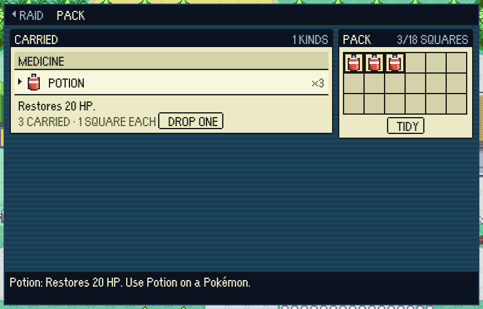
</p>

## Home sweet Harbour

Between raids you're at The Harbour, your own little base, and it's a place you walk around rather
than a menu. Four buildings, four people you'll recognise, and each one is a thing you can do:

- **Professor Oak's Lab** is where raids start: the contract board, your loadout, and a wall map
  that lights up wherever you've walked.
- **Nurse Joy's Pokémon Center** looks after the team. She heals in full, and she charges in
  time: what she spends comes off your next raid's clock.
- **Brock's Workshop** builds permanent upgrades, paid for in the materials you haul home and the
  Pokémon you can spare, and every one of them turns up on the map: a radio mast, a beacon, cellar
  doors in the quay wall.
- **Bill's cottage**, down on the quay, is where Pokédollars go, and where gear, evolution stones
  and HMs are bartered for things you found. Everything you trade him ends up on his shelves.

At the end of the row, behind the window boxes, is a fifth: **The Bolthole**, which is yours.
It's the player's house from FireRed, downstairs and up, and it fills up with what you've done:
a badge case with a slot for every keeper in Kanto, lit as you beat them; a pennant on your
bedroom wall for every place you've come home from; a telly whose Kanto Tonight tells you which
rival is hunting you next; a raid log on your PC; and a rug the colour of your starter. It keeps
your hours, too: the window goes orange at dusk and dark at night, there's a pumpkin by the door
all October and a tree in the corner all December. Nobody hunts you there.

And you never walk it alone. The starter you picked trots one step behind you, in your own
footsteps, through every door and into every room, drawn in HeartGold and SoulSilver's own
following-Pokémon art. Turn round, press Space, and it'll tell you how it's doing. It's that
Pokémon and nobody else, so lose it in a raid and the Harbour gets very quiet.

<p align="center">
  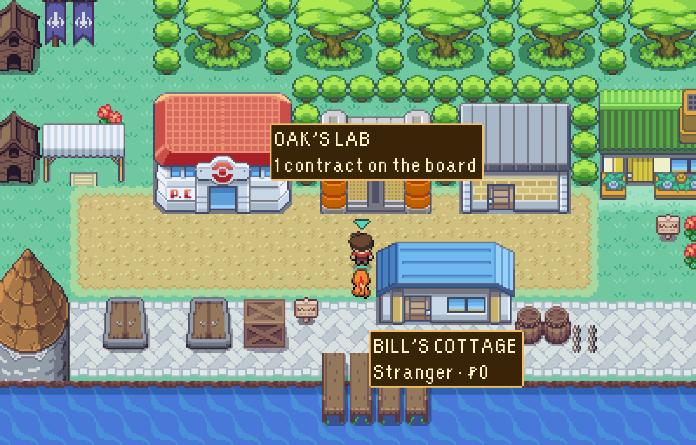
</p>

<p align="center">
  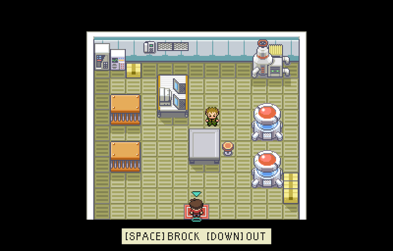
</p>

## The cast

<p align="center">
  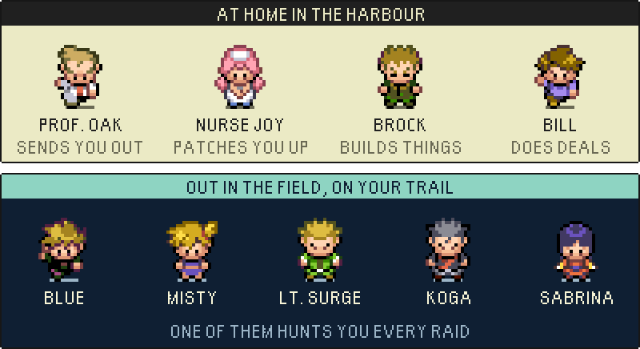
</p>

The five rivals take turns, one per raid, and each has their own voice for arriving, catching you,
losing you and losing to you. None of them is subtle about it.

## The world

| Map | What it is |
|---|---|
| **Floodplain Relay** | Where it all starts: a drowned river town round Market Isle, 128 tiles square, with the river running on south to the tide. |
| **Pallet Town** | A mill town in a valley that's mostly water, read from the spring at the top to the saltings at the bottom. There's a cave under the quarry hill. |
| **Route 1** | Two roads and a braid of paths between them, plus orchards, paddocks and a brook with three very different crossings. |
| **Viridian Forest** | A deep wood, with a fire tower, a charcoal burn somebody still works, and a ledge only you can jump down. |
| **Viridian City** | Drawn to FireRed's own standard on Kanto's own art, with eighteen townspeople who'll tell you where things are. |

A few things worth knowing before you go:

- **Every map has a boss, and every boss holds a door.** Beat them and the door stays open for good.
- **Some doors need a move, not a fight.** Teach a Pokémon Cut or Surf and new places open up.
- **Prizes gleam.** Every map has an evolution stone somewhere in it, and on a raid where one turns up you can see it shining from a long way off. Is it worth the detour with forty seconds on the clock? Yes. No. Maybe.
- **The drop-in map is dark where you haven't been.** Walk it, come home, and watch the dark pull back.
- **Contracts change how a raid goes:** survey three stakes, carry a ledger out through one particular exit, or spend your own Potions resupplying a warden.

## Draw your own map

Choose **MAKE A MAP** on the title screen and you get the game's own map maker: paint ground, plant
buildings, place people, signs, trainers, exits and drop-in points, then press **WALK IT** or
**RAID IT** to play it for real, clock and all. A checklist tells you whether it works before anyone else
has to find out. Send in a map you're proud of, and once it's approved it goes into the game for
everybody, under **PLAYER MAPS**, with your name on it.

<p align="center">
  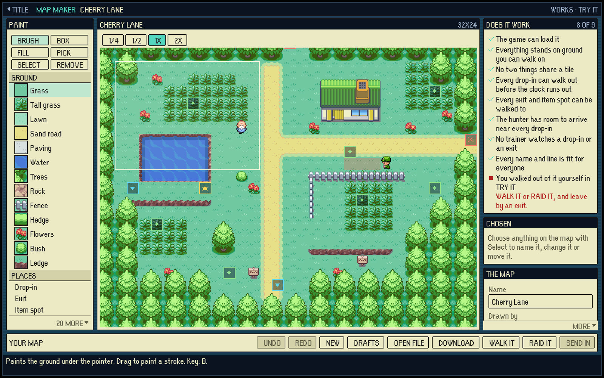
</p>

Right next to it on the title: **PLAYTEST**, an explorer's run where nobody can knock you out, every door
is open and holding <kbd>Shift</kbd> walks three times faster. For sightseeing. Purely for
sightseeing.

## Also in the box

- Pokémon that learn moves as they level, and ask before forgetting one.
- Evolution by level and by five evolution stones.
- Eight TMs and HMs to find or barter for.
- A double battle, if you get far enough to earn it.
- Rain in the places that are made of water, and it changes how the fight goes.
- Trainers who watch a stretch of road. Step into it and you're paying a toll.
- Every sound effect synthesised in the browser. No music: the game's owner finds it annoying, and so the game has none.

## Controls

| Key | In a raid | At home |
|---|---|---|
| <kbd>←</kbd> <kbd>↑</kbd> <kbd>→</kbd> <kbd>↓</kbd> or <kbd>W</kbd> <kbd>A</kbd> <kbd>S</kbd> <kbd>D</kbd> | Walk | Walk |
| <kbd>Space</kbd> / <kbd>Enter</kbd> | Talk, read, work a landmark, choose | On a door mat: open that keeper's counter |
| <kbd>B</kbd> | Open the pack | |
| <kbd>P</kbd> | Open the party | |
| <kbd>O</kbd> | Open the field guide | |
| <kbd>L</kbd> (hold) | Look: every caption on screen speaks | |
| <kbd>Esc</kbd> | Close a screen | Back out of a screen |

Every menu works with the mouse as well.

## Run it on your own machine

The quickest way to play is the [live build](https://ollysalanson.github.io/escape-from-pallet-town-web/),
which updates every time `main` does. To run it yourself you need [Node.js](https://nodejs.org/):

```bash
npm install
npm run dev
```

Then open the address Vite prints. Your save lives in the browser, so it's yours alone.

## For developers

It's TypeScript, [Phaser 3](https://phaser.io/) and [Vite](https://vite.dev/), with no game server: everything runs in the page.

| Command | What it does |
|---|---|
| `npm run lint` | ESLint |
| `npm run typecheck` | TypeScript (`tsc --noEmit`) |
| `npm run test` | Vitest |
| `npm run build` | The production bundle |

Run all four (`npm run lint && npm run typecheck && npm run test && npm run build`) before opening
a pull request; GitHub runs them again on `main` after every merge. The test suite runs on four
workers so several checkouts can share one machine, and `VITEST_MAX_WORKERS=12 npm run test`
gives it the whole box.

`?testmode=1` on the dev server runs the game on the Canvas renderer at ten frames a second and
adds `pauseLoop()`, `stepFrames(n)` and `resumeLoop()` to `window.__escapeFromPalletTownGame__`,
for automated checks that drive the game in a headless browser; `?testmode=pixels` keeps WebGL for
screenshots. Neither changes a rule of the game, and a production build ignores both.

Where to read more:

- [Pitching in](CONTRIBUTING.md): bugs, ideas, maps and code, and how each one finds its way into the game.
- [AGENTS.md](AGENTS.md): how the game is put together and why, subsystem by subsystem.
- [Product direction](docs/product-direction.md): the game's promise and the player research behind it.
- [Deployment](docs/deployment.md): how GitHub Pages publishing works and how to check a deploy.
- [Driving the game in a headless browser](tools/playtest/README.md): the playtest tools, test mode and what each costs.
- [Tilesets](docs/tilesets/README.md): seeing a sheet or a map rather than imagining it.
- [The roster](docs/pokemon/roster.md): the 151, and what the import could not bring in.
- [Screens](docs/screens/): before-and-after screenshots for most of the changes the game has had.
- [docs/readme](docs/readme/README.md): how the pictures on this page are made, so they can be made again.

## The small print

This is a free fan project, made for fun. It is **not affiliated with, endorsed by or sponsored by
Nintendo, Game Freak, Creatures Inc. or The Pokémon Company**. Pokémon and every name, character and
design belonging to it are trademarks of their respective owners.
