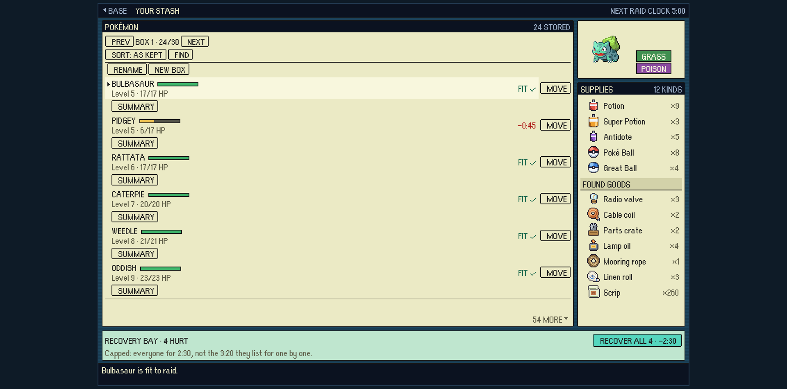
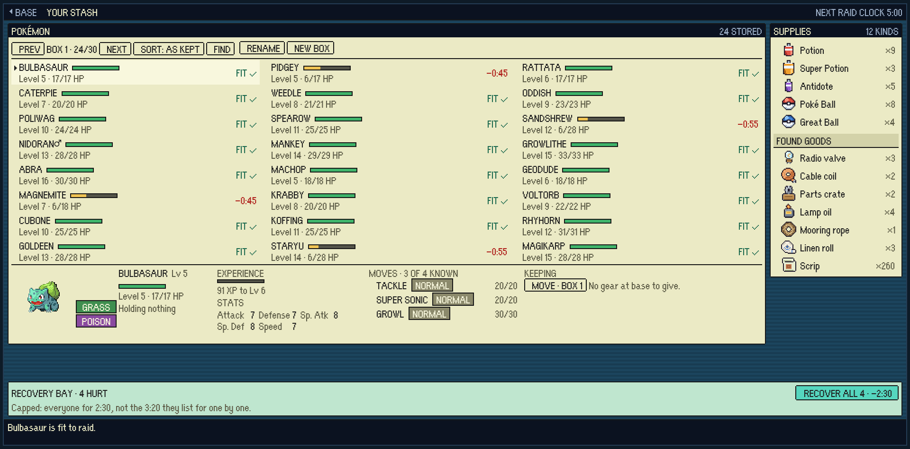
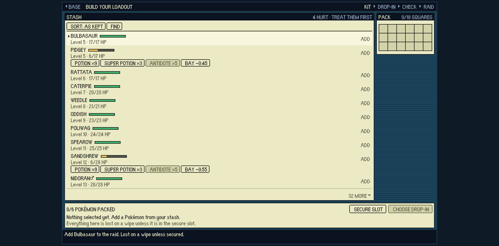
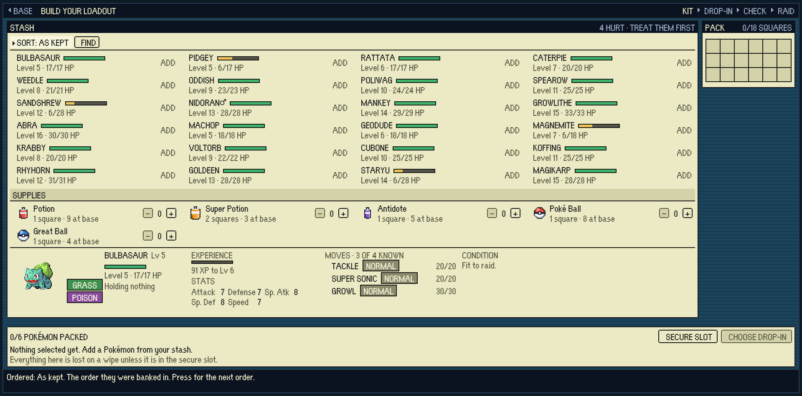
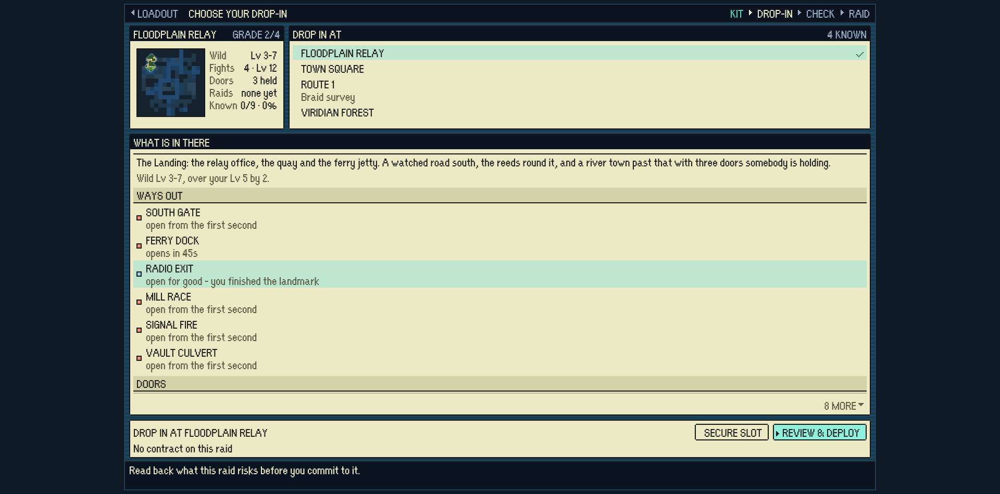
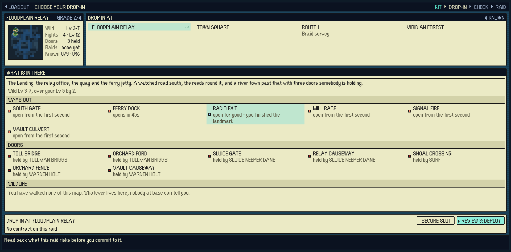
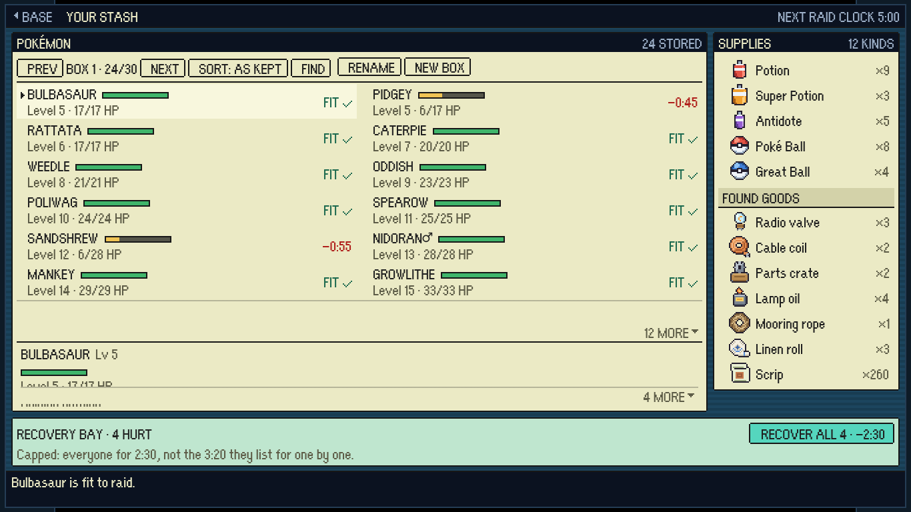
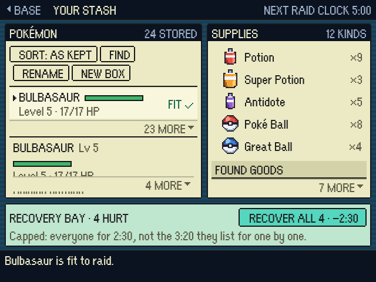

# The screens fill the width, and the answer is on the same screen

The captain, after the menus were given the browser window (PR #148):

> yeah we still need to solve the menus looking really crammed and condensed
> they need their own screen space are we doing something about that because
> like if you have to scroll scroll through a little box to see all your items
> and they're all hidden behind other boxes and menu screens it doesn't really
> work very well so yeah what we're doing about that

Two complaints, and #148 is why he is still making them. It gave the screens the
whole window - that part worked - and changed nothing about how the *contents*
are laid out inside it, so a wide display held a tall thin list down the middle
with a scroll wheel on it and a hand's breadth of backdrop either side.

## 1. A collection is a grid, not a column

`.px-body` was `grid-template-columns: minmax(0, 1fr)` and `.px-list` a single
implicit track, so every list was one column however wide the screen was; and
`MENU_MAX_WIDTH` capped a screen at 720 game pixels, which at 1920x950 left a
quarter of the window unused.

- `src/game/ui/columnLayout.ts` counts the tracks. A pane says the narrowest a
  column of it may be (`COLUMN_MEASURES` in `ui/pixelUi.ts`, measured off the
  rows) and takes as many as the room holds. **Every track is a whole number of
  game pixels**: the room left after the gaps is shared out a pixel at a time,
  first tracks first, never `1fr` - which divides the room into thirds of a
  pixel and draws every one-pixel frame in the list soft.
- `MenuOverlay.layoutColumns()` measures the pane and writes the tracks, in the
  same pass that snaps text boxes to the grid - so it follows a live resize.
- `MENU_MAX_WIDTH` is 1120, because the measure is now the *column's*.

One column is still the right answer in a narrow window, and is what a narrow
window gets: nothing is written at all below two columns.

## 2. The answer is on the same screen

A Pokemon's experience, stats and moves were a whole second screen, reached by a
SUMMARY chip that stood on every row of the stash beside MOVE, TAKE and GIVE.
Twenty-four Pokemon were therefore a hundred controls and a scroll wheel, with
the thing you came for a layer down.

It is the PC box instead: the collection fills the width, a row is the two lines
that tell one Pokemon from another, and everything about the one under the
cursor - portrait, types, condition, gear, experience, stats, moves, and every
deed the screen offers - is the detail pane beneath the list, the same
`.px-detail` the contract board and Brock's ladder already use. The
loadout's treatment chips moved there too, for the same reason.

The `summary` view is gone. Nothing is behind anything.

## What a player can see, at the captain's window

A realistic save: 24 Pokemon, twelve kinds of supply, four maps unlocked
(`tools/playtest/menuShots.mjs` seeds exactly this). Rows wholly on screen out
of rows in the pane, printed by that tool.

| screen | pane | before | after |
|---|---|---|---|
| stash | Pokemon | 14/50 | **24/24** |
| stash | supplies | 12/12 | 12/12 |
| loadout | stash | 10/29 | **29/29** |
| drop-in | what is in there | 6/14 | **14/14** |
| Bill | shelf, table | 5/5, 8/8 | 5/5, 8/8 |
| Brock | ladder | 7/7 | 7/7 |

Before, a stash row was two controls (the Pokemon and its MOVE chip) and carried
a care strip under it, which is why the pane held 50 rows for 24 Pokemon; after,
a row is one control and the pane holds 24. At 3840x2000 the same two screens go
16/50 -> 24/24 and 11/29 -> 29/29.

## The screens

| | |
|---|---|
|  |  |
|  |  |
|  |  |

And the same stash on the two windows either side of the captain's:

| 1366x768 | 640x480 |
|---|---|
|  |  |

At 1366x768 and below the detail band stands in one column and scrolls, because
its five blocks need 820 game pixels to stand side by side and a band that wraps
is a band cut through the middle (`roomFor` in `columnLayout.ts`). The floor
stage is 320x240 game pixels, where a list, a band and a commit bar have about a
hundred pixels of height between them: it works, and it is tight, and that is
what the floor has always been.
