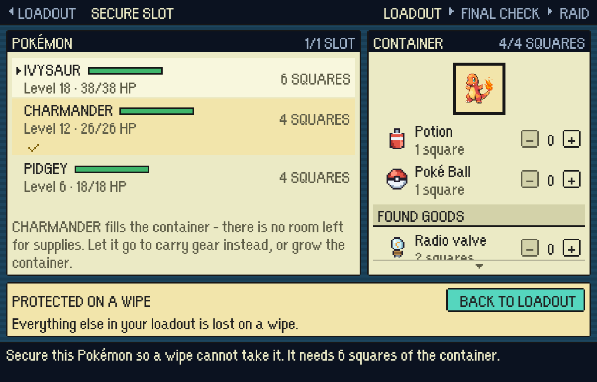
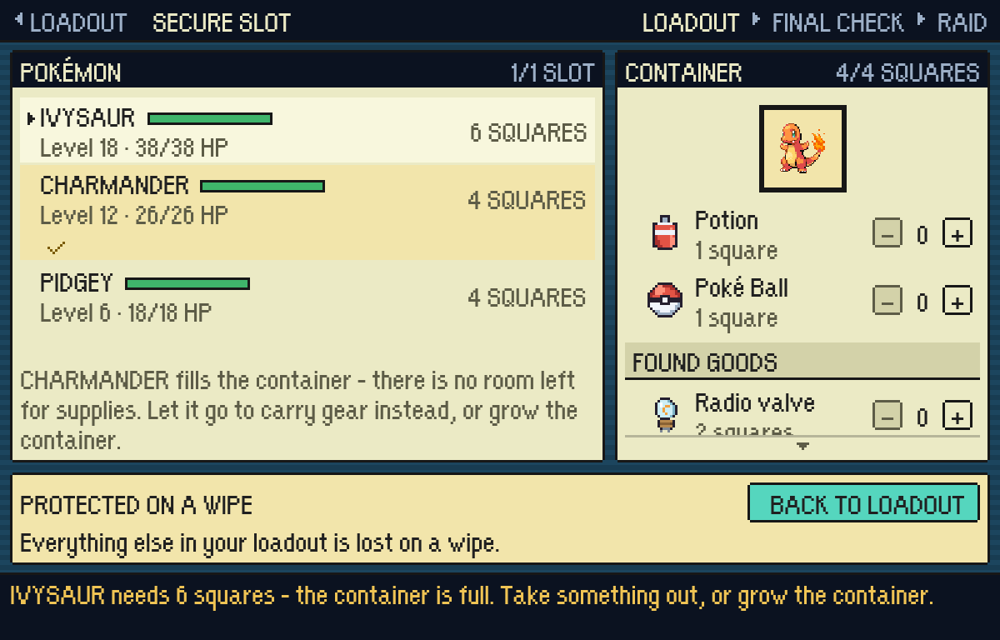
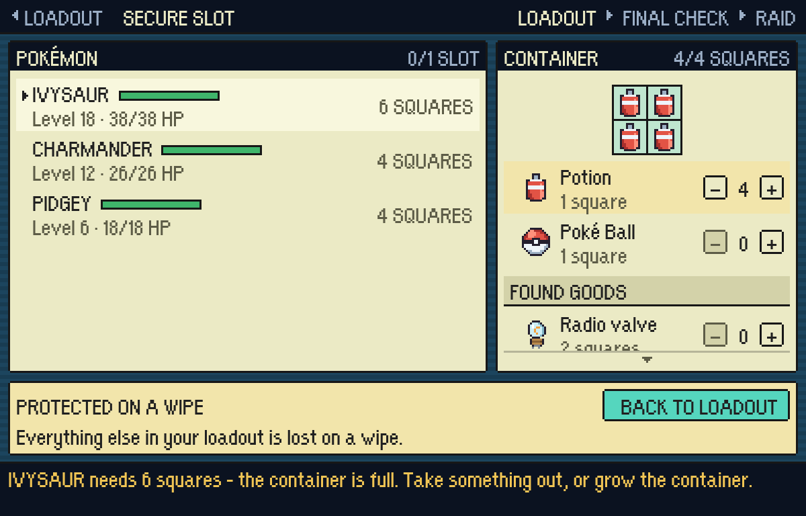
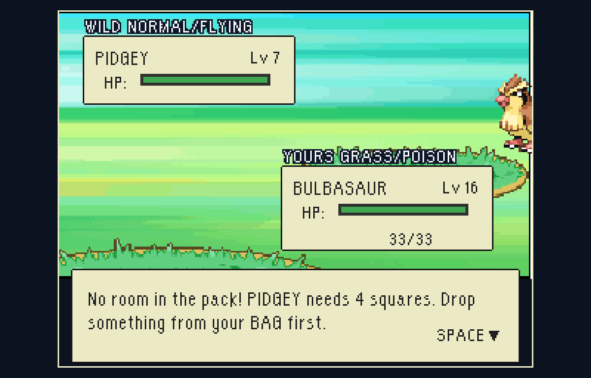
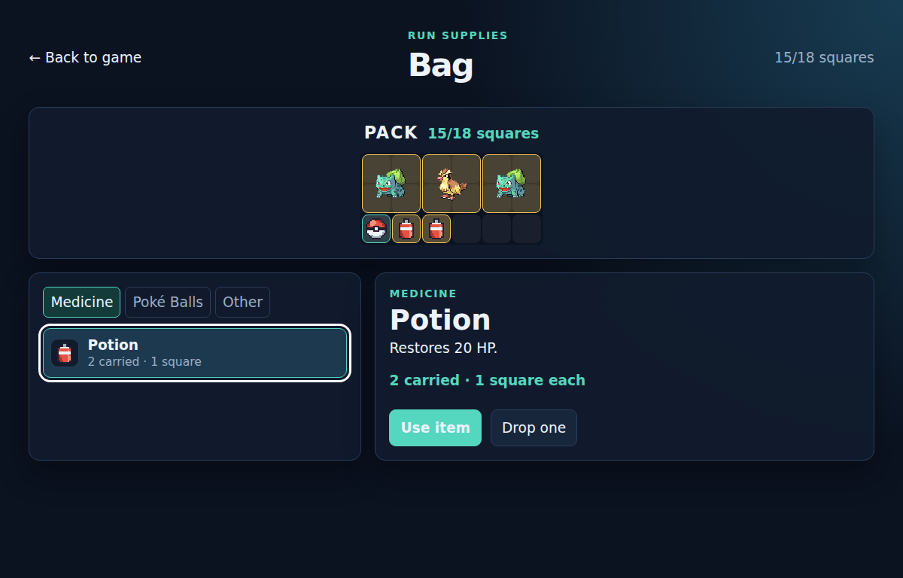
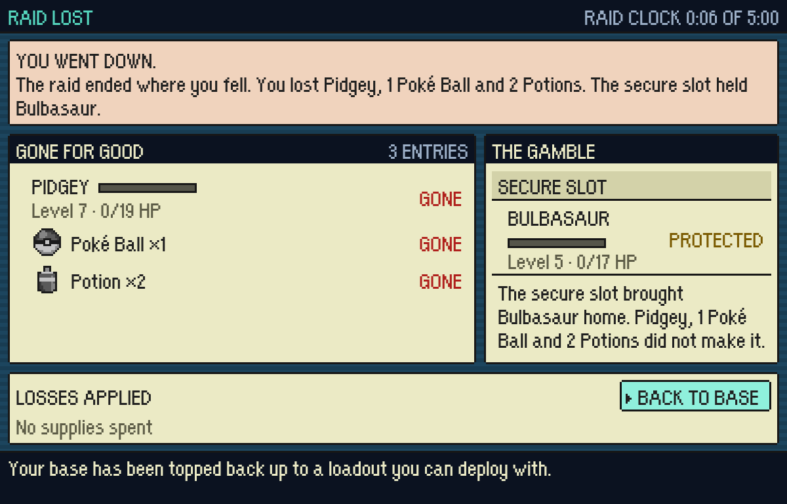

# A Pokemon takes squares

The captain, 2026-09-19: "Pokemon should take up four squares in the bag, and
then when it evolves it should take up six squares, and then when it evolves
after that it should take up nine squares." And: "The secure slot should be
auto-filled, and if you remember your choices from last time, Pokemon should
always be the first thing to be auto-loaded, ordered by level."

A Pokemon being carried home is **cargo** (`pokemon/pokemonCargo.ts`,
`items/itemGrid.ts`'s `GridCargo`): 2x2, 3x2 or 3x3 by how far along its own
line it stands, seated in a container before any supply. The deployed party is
not cargo - it walks beside you - so what costs squares is a catch or a gift.

Shot at 3x (1200x768) in `?testmode=pixels`, played through the real screens.

| | what it shows |
|---|---|
|  | The container fills itself with the party's best Pokemon that *fits*: Charmander at 12, not the Ivysaur at 18, because six squares do not go into four. Four squares of four, so nothing else goes in - and the note says so rather than leaving the steppers dead. |
|  | Pressing the Ivysaur anyway. The refusal is the price in squares and the way out of it. |
|  | The override: the Pokemon comes out with one press and four Potions go in. That choice is what the save remembers for the next raid. |
|  | Three catches in the pack already. The fourth is refused **before the ball is thrown** - by name and by price - because losing it afterwards would be the same fact told dishonestly, and finding out should not cost a ball. |
|  | The pack on the way home: three caught Pokemon standing in twelve of its eighteen squares, with three left. Catching costs the room you were keeping for Potions and loot. |
|  | A raid lost carrying one. The caught Pidgey is named under GONE FOR GOOD, and the auto-filled slot brought the partner home. |
