# The raid's own screens, in the game's own language

The captain, playing:

> i've also noticed that the bag still uses the browser type menu screens it
> doesn't have our aesthetic that we've installed on the new menu screens on
> the front so yeah those need updating too

He is right, and the reason he is right is on the record: PR #148 gave the DOM
screens the browser window, PR #149 taught them to fill it, and both stopped at
the lobby. What was left was three screens in two other languages - a dark
rounded one for the pack and the party, a green terminal for the field guide -
opened from inside a raid, where the rest of the game is cream, framed and set
in Orange Kid.

They are pixel-ui now: the same parts (`ui/pixelUi.ts`), the same one cursor and
help bar, the same column rule (`ui/columnLayout.ts`), the same windows. Only the
Test Lab is still the old style, which is a dev tool and nobody's game.
`src/game/scenes/raidScreens.test.ts` holds all three to that rather than to a
resemblance.

## What a player can see, at the captain's window

Six deployed, five kinds of supply packed. Rows of the screen's own collection
that are wholly on screen, out of rows in it - and how many columns the list
takes, which is the half of #149 that mattered most.

| screen | collection | before | after |
|---|---|---|---|
| pack | what you are carrying | 3/3 in 1 column, **one pocket of three** | **5/5 in 4 columns, every pocket** |
| party | who is deployed | 6/6 in 1 column | **6/6 in 4 columns** |
| field guide | what to do next | 4/4 in 1 column | 4/4 in 1 column |

The pack's row counts are the point rather than the numbers: before, a pocket at
a time behind a tab strip, so three of the five kinds carried were on screen;
after, all five, banded by pocket. The field guide is four wrapped paragraphs
either way - a column is the right answer for a sentence, and what changed there
is that it is the game's own window rather than a terminal.

And at 640x480, the smallest window the game supports:

| screen | before | after |
|---|---|---|
| pack | **1/3 rows, and the screen itself drawn outside its box** | **5/5 rows** |
| party | 5/6 rows, detail column off screen with no cue | 3/6 rows, `3 MORE` over a drawn track |
| field guide | 4/4 rows, footer drawn outside its box | 4/4 rows |

`tools/playtest/menuShots.mjs --raid` fails a screen that draws outside itself.
Before, all three did at 640x480 (`menu-shell`, `party-layout`, `bag-layout`,
`FOOTER`, `KBD`); after, every one of the five sizes driven - 640x480, 1280x720,
1920x950, 2560x1330, 3840x2000 - is clean, as is a live resize with a screen
open.

## The screens

| before | after |
|---|---|
| 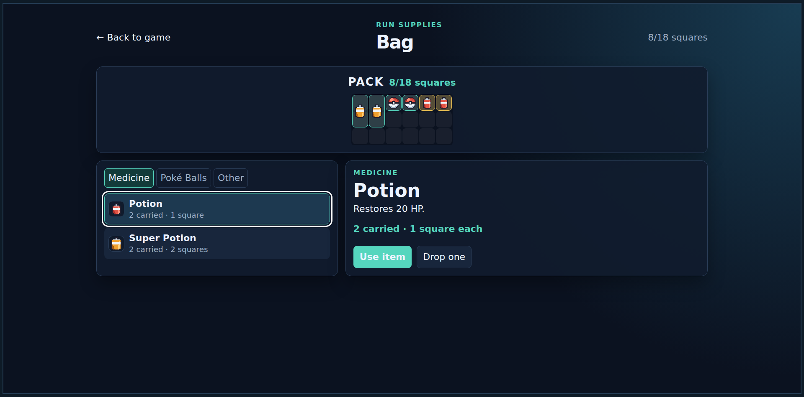 | 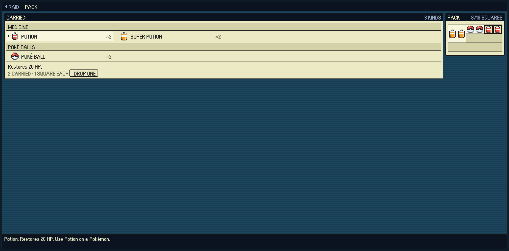 |
| 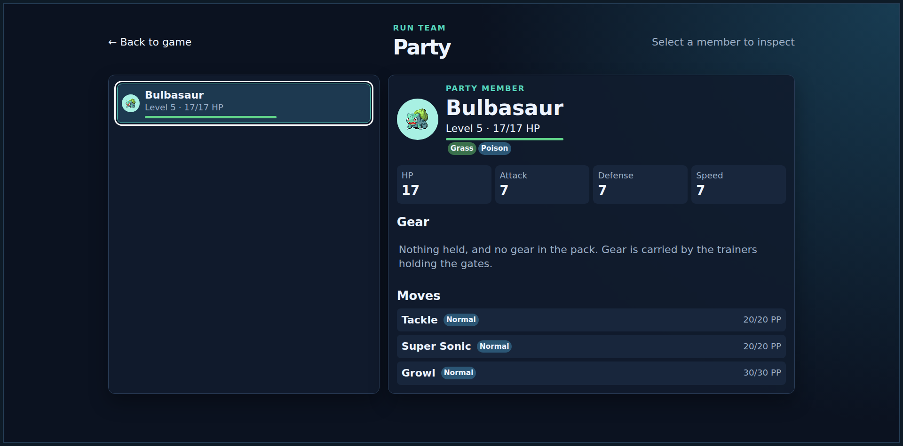 | 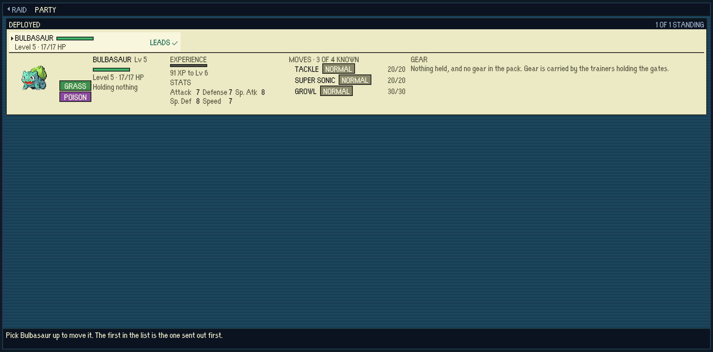 |
| 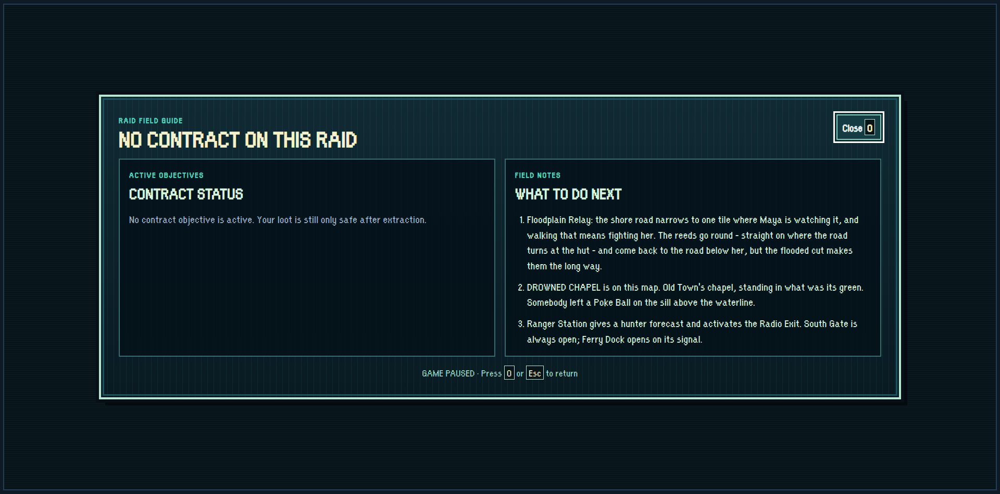 | 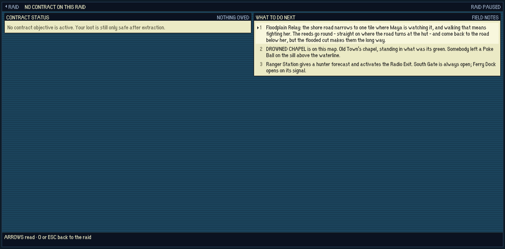 |

And at 640x480, where the before is cut off mid-row with the buttons it needs
below the fold of a page that scrolls:

| before | after |
|---|---|
| 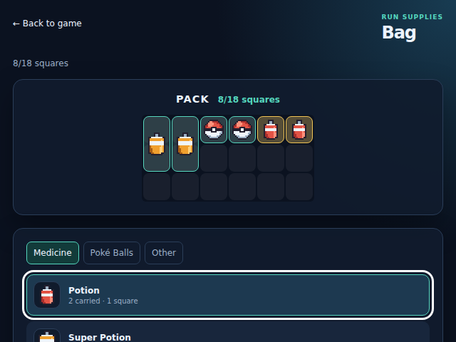 | 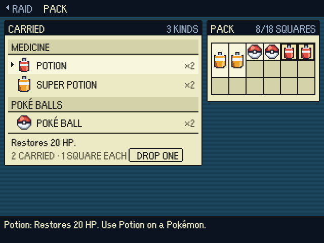 |
| 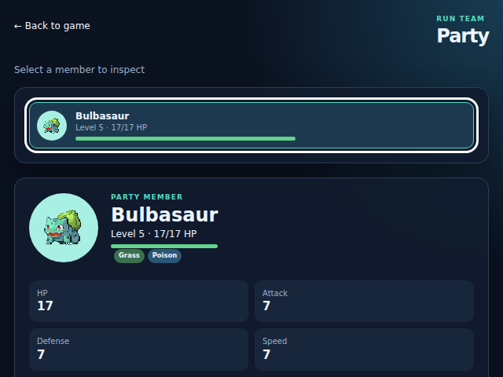 | 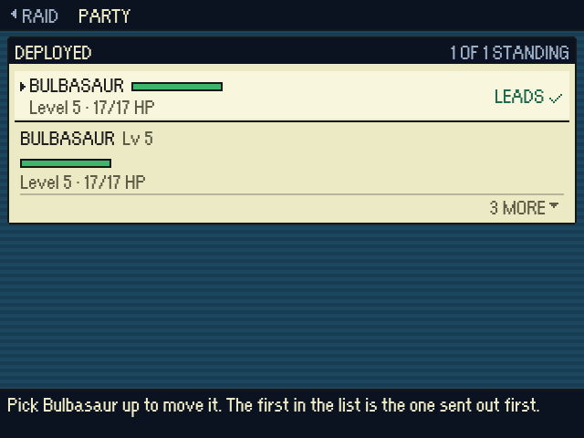 |

## Three things that are not paint

**The pack has no tabs.** A row of pockets above a list is a layer between the
player and the Potion at the moment they have least time for one. The pack is
eighteen squares; all of it fits on one screen with a `.px-subheading` band
naming each pocket. Gear is one of them for the first time - it was in no pocket
at all, so a Quick Claw taken off a boss was carried out of a raid without ever
appearing in the bag.

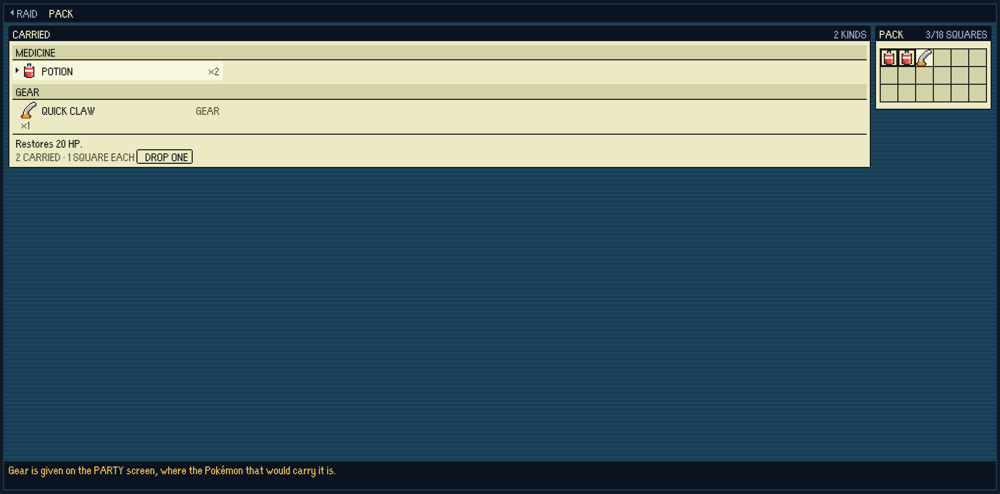

**The row is the act.** Enter on a Potion opens the recipient list, so using one
is four presses: open, point, Enter, point, Enter. What the item *is*, and the
drop, are the pane under the list, where the contract board and the Outfitter's
ladder already put what the cursor is on. The squares that item is standing on
light up in the container beside it - by a class on a block, not a re-render,
because the cursor moves on every arrow key and this screen is read under a
clock with the hunter somewhere on the map.

**The party is the stash's shape.** A row is the two lines that tell one Pokemon
from another and the pane under it is the whole dossier - portrait, types,
condition, experience, stats, moves, gear. That pane is one module now
(`src/game/ui/pokemonDossier.ts`), drawn by the lobby and the raid alike, rather
than two copies of the same idea that can drift. The party can also set its own
order again: the canvas screen could, its DOM replacement quietly could not, and
its footer still advertised `ENTER: MOVE`.

## Three faults found on the way, two older than this change

- **A `.px-scroll` pane may never have bottom padding of its own.** The
  stylesheet already said so, with the reason; `.px-dossier` re-added two game
  pixels of it further down the file. A sticky MORE strip sticks to the
  *content* edge, so those two pixels drew the tops of the next line's letters
  under the very cue that exists to stop a row being half drawn. The stash had
  it too. `style.test.ts` now fails a later rule that puts it back.
- **A dossier line is a row the strip must take whole.** `SCROLL_ROWS` did not
  know about them, so at the smallest stage the fold ran through
  `Level 5 · 17/17 HP`. With the strip taking it whole, a 48-pixel pane became a
  name and a bar - so the narrow pane is 52, measured rather than chosen, which
  is three lines and the strip.
- **Nothing is said twice on one screen.** The bag's title bar carried
  `8/18 squares` over a container whose lid says `8/18 squares`; the party said
  its standing count twice the same way. Each is said once, on the window it
  belongs to.
