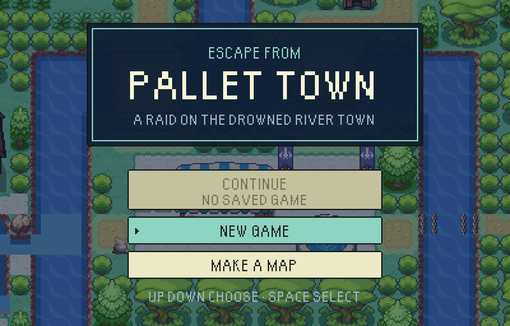
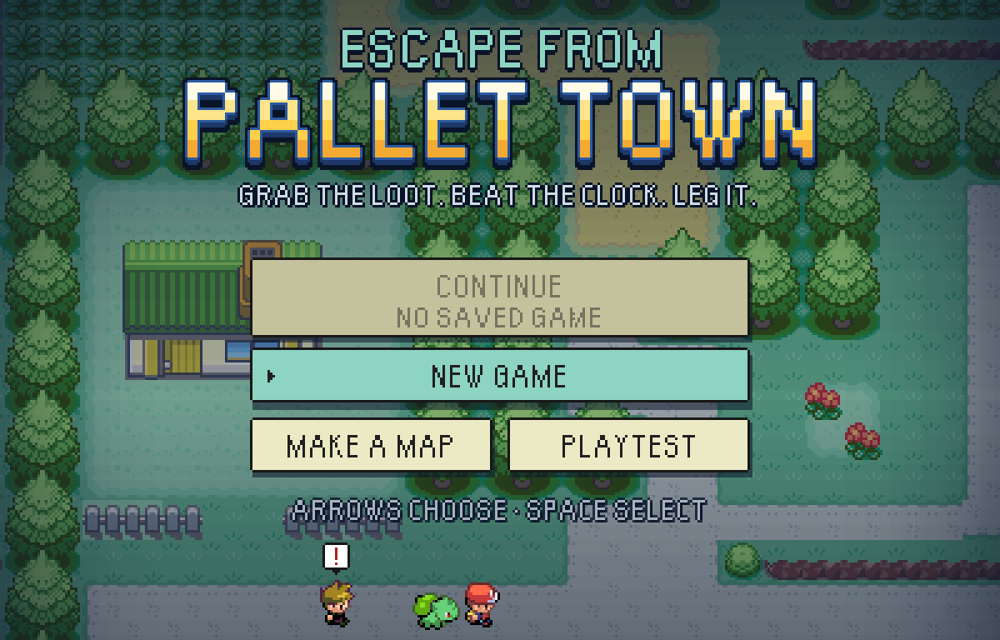
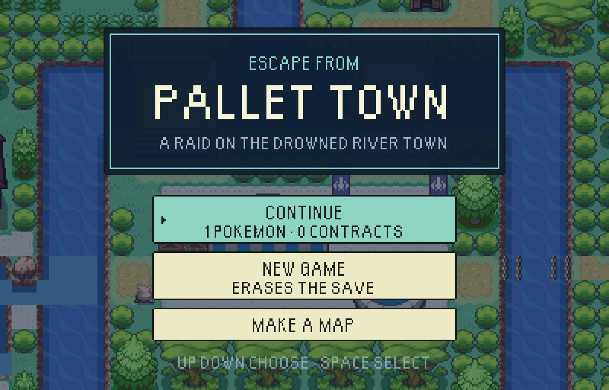
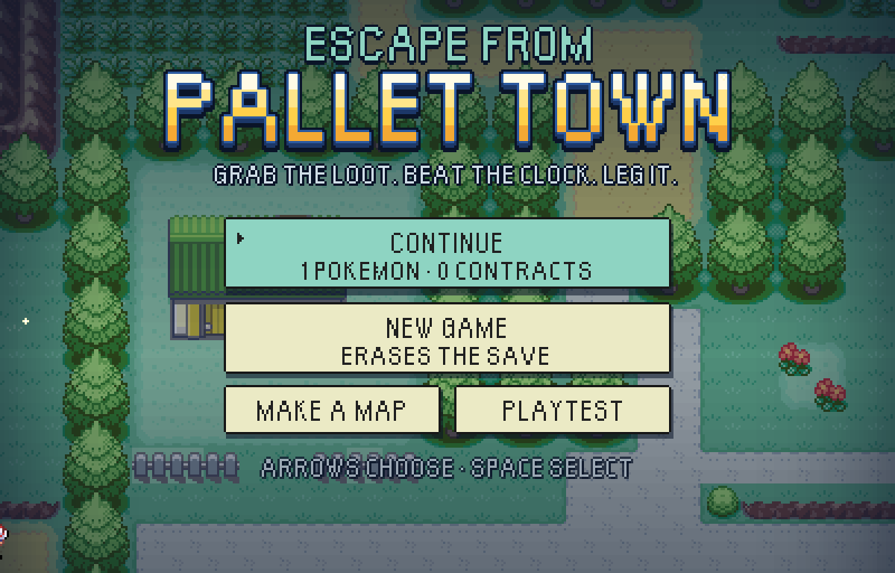
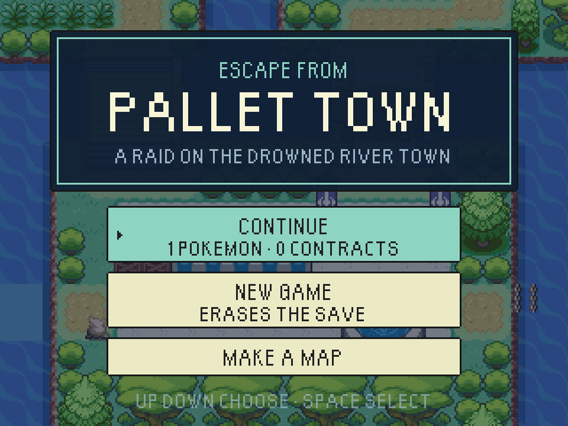
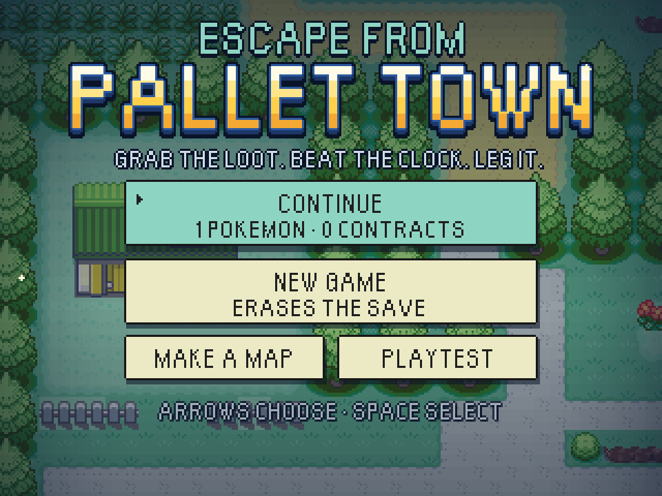
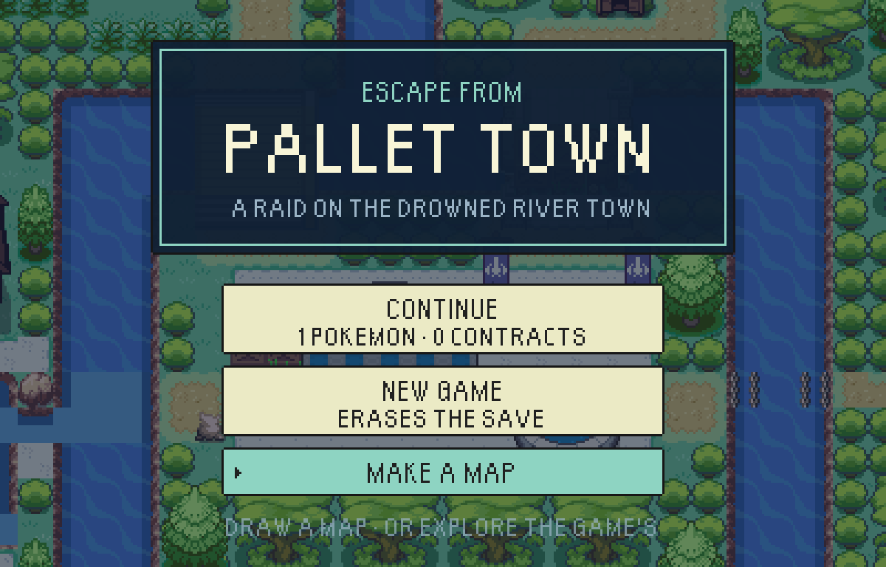
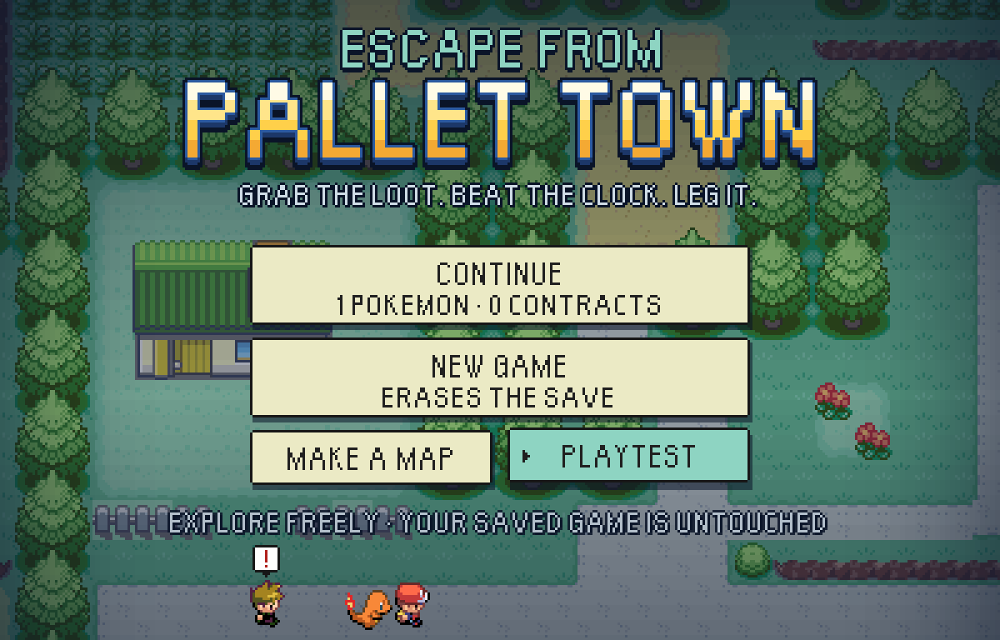
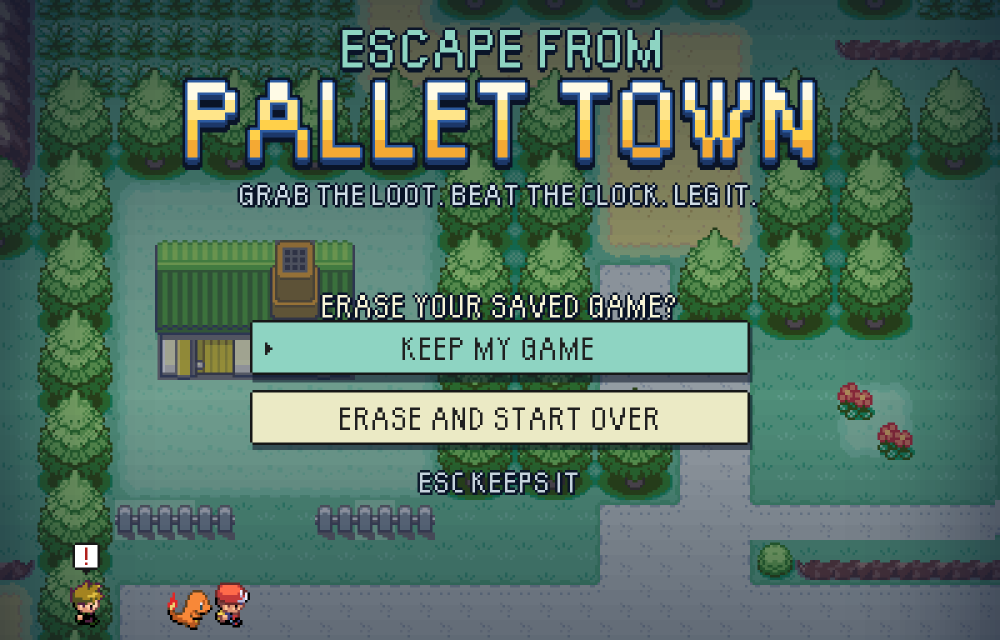
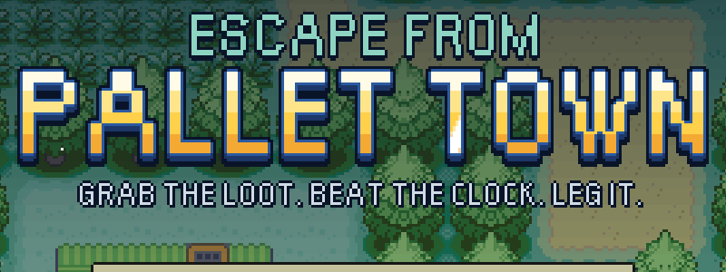

# The title at dusk

The first screen, redrawn as the front page's banner come alive (`docs/readme/hero.svg`). Screens at
3x (`*-3x.png`, the 400x256 stage in a 1200x768 window) and on the smallest stage (`*-small.png`,
320x240 at 3x). Every picture is a WebGL test-mode build, photographed by
`tools/playtest/titleShots.mjs`.

| Before | After |
|---|---|
|  |  |
|  |  |
|  |  |
|  |  |

And the erase question, which still starts on KEEP MY GAME: 

The shine crossing the name, a moment in: 

## What moves

All of it is a pure function of the time since the title appeared (`src/game/ui/titleScenery.ts`),
and every answer is a whole pixel.

- **Viridian City drifts by**, a pixel every 64ms, one way and back: the real map through the same
  layers a raid draws, from its ponds and rock down to the main street along the foot.
- **Dusk** is stepped bands, heavy at the top so the name always has dark behind it, with a side
  vignette drawing the eye in.
- **Sparkles** open and close all over the town, each turning up somewhere new every time.
- **The name** is Orange Kid stamped into a gold logo: the edge, the blue rim and the depth under
  the letters are the same lettering stamped again in other colours. Every six seconds a slanted
  shine crosses it and leaves a glint on the N.
- **The chase**: every fifteen seconds the trainer legs it along the main street with their partner
  at their heel - the save's own partner, or one of the three starters on a fresh browser - and Blue
  right behind with his "!". It runs the other way on the next lap.
- **The cursor** nudges a pixel towards the choice, and the chosen button stands a pixel proud of its
  shadow.

People whose system asks for reduced motion get the still picture.

## The menu

CONTINUE and NEW GAME as before. **MAKE A MAP now opens the map maker and nothing else**, and
**PLAYTEST** (the explorer run) has its own button beside it rather than hiding inside it - half a
row each, because four full-width rows do not fit the 320x240 stage. Up and Down walk every button in
reading order, Left and Right cross the shared row, and Space and Enter both press.

## Making them again

```bash
VITE_EPTW_TEST_MODE=pixels npx vite build --outDir "$SCRATCH/root/escape-from-pallet-town-web"
python3 -m http.server "$PORT" --directory "$SCRATCH/root" &
node tools/playtest/titleShots.mjs "http://localhost:$PORT/escape-from-pallet-town-web/" "$SCRATCH/shots" \
  --windows=1200x768,960x720 --at=1900,4300
```
