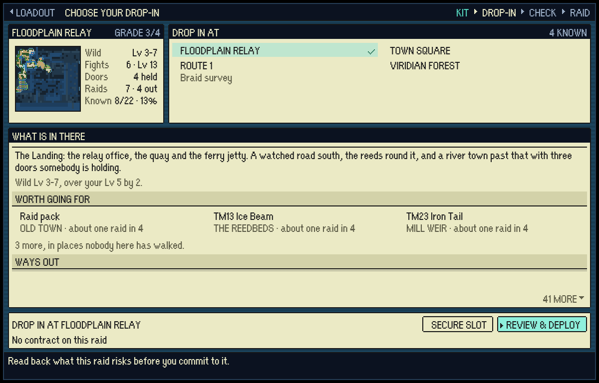
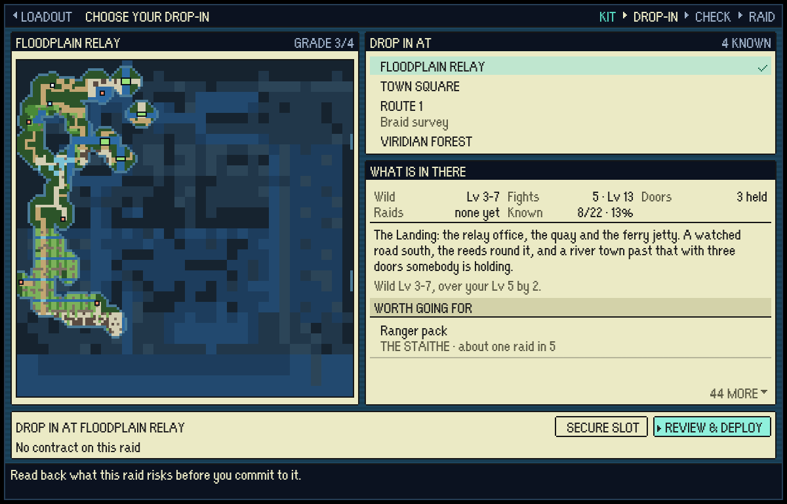
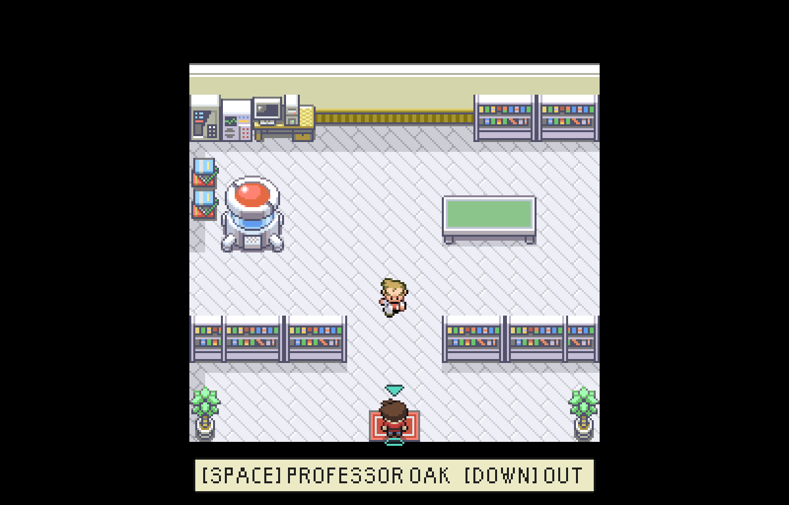
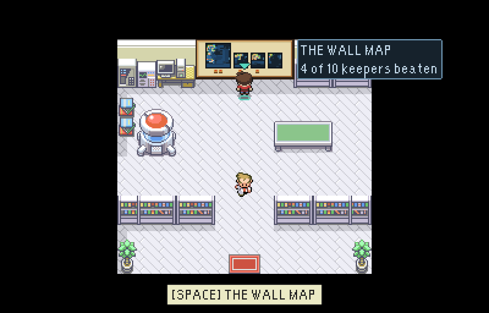
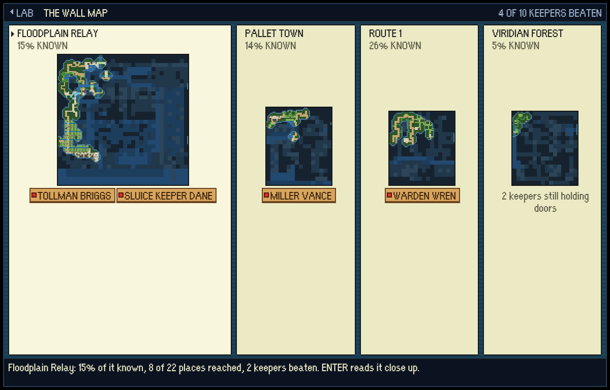
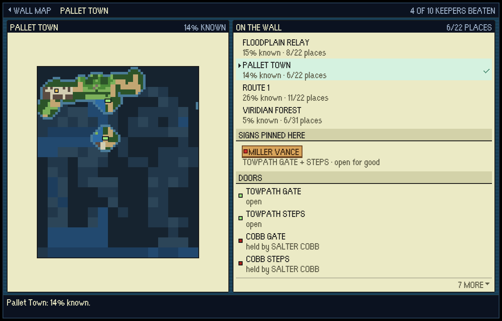

# The wall map in Oak's Lab, and the drop-in map drawn large

Two changes to one picture: the bird's-eye map of a place, dark where nobody
has walked (`world/minimap.ts`). Nothing about any map's layout or size changed.

## The drop-in map, drawn as big as the window

| before | after |
|---|---|
|  |  |

It was a thumbnail in a banner a fixed 100 game pixels tall, so the Floodplain
was squeezed to two tiles to the pixel in a 64-pixel square while most of the
window sat empty. Menus use the whole window (the captain's rule), so now the
map is a window down the whole left of the screen, drawn at the largest whole
number of game pixels to the tile that fits (`fitPicture`). That is 2x for the
Floodplain and 3x for the other three at the usual 1200x768 window, and up to
5x on a 1080p display. Ways in, ways out and doors get a dark ring once a tile
is big enough to ring, so they read as pins rather than dots. The five short
facts moved to the head of "What is in there".

The frame is always sized for the biggest map, so nothing on the screen moves
when the cursor changes the place. At the smallest stage (320x240,
`drop-in-smallest.png`) the frame is 126 pixels tall, two short of drawing the
Floodplain tile for tile, so that one case is still condensed.

## The wall map

| the lab before | the lab after |
|---|---|
|  |  |

The bare stretch of back wall Oak's Lab kept for it now holds a board with the
four maps side by side at **one scale**, so the Floodplain hangs four times
the size of Route 1 because it is. Each is lit where a raid has walked and
dark everywhere else, and **every keeper you have beaten has a sign pinned
under the map they held**. The board is painted from the save each visit
(`base/wallMap.ts`), so nothing is stored. `lab-render.png` is the same room
drawn by `tools/base/renderBase.mts --room=oaks-lab --beaten=... --survey=...`.

Stand under it and the hint line says `[SPACE] THE WALL MAP`. Press it:

All four at a glance, at one scale. Each card is as wide as its map is
(`shareTracks`), and the scale is the largest at which all four fit, so at
1080p the whole wall goes up to 2x (`wall-map-1080p.png`). Names, maps and
signs share rows across the cards (a CSS subgrid), so the four maps stand on
one line even when a name wraps at the smallest stage (`wall-map-smallest.png`).

ENTER on a map reads it close up, drawn like the drop-in screen, with the
signs pinned there, its doors and its ways out listed beside it. Each has a
swatch in the colour the map draws it in, so the list is the legend.

ESC goes back to all four, and ESC again puts you back on the tile you read
the wall from, facing it, not at the door.

## Playing it

`tools/playtest/wallMapShots.mjs <url> <dir> [--window=WxH] [--survey=path]
[--beaten=ids]` walks into the lab and up to the wall, reads every map with the
keyboard, backs out and photographs each step. It fails loudly if the hint line
does not name the key, if the arrow keys cannot reach a map, or if backing out
leaves the player anywhere but in front of the wall. The survey in these shots
comes from `tools/tileset/sampleSurvey.mts -- out.json floodplain-relay=9
route-1=5 pallet-town=3 viridian-forest=2`, which is roads walked from each
front door to its nearest ways out and landmarks.
