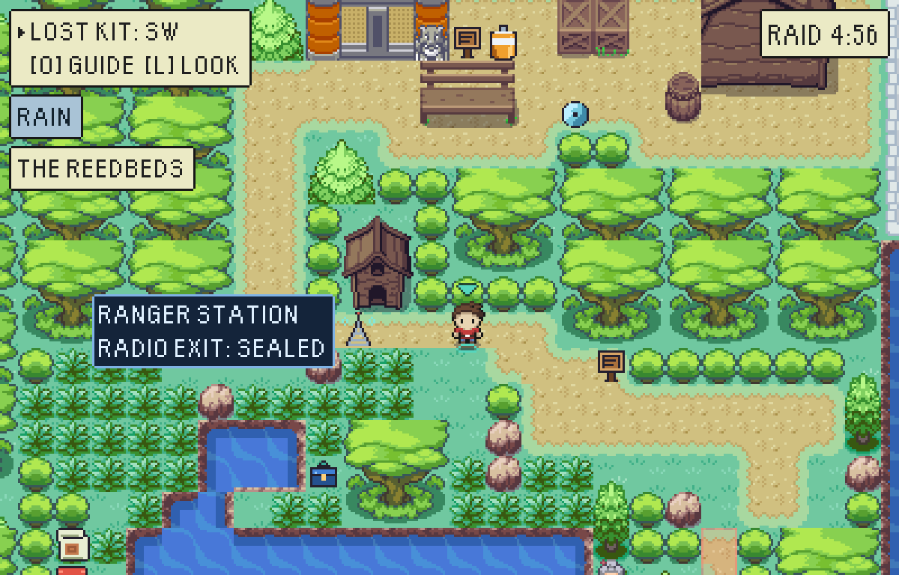
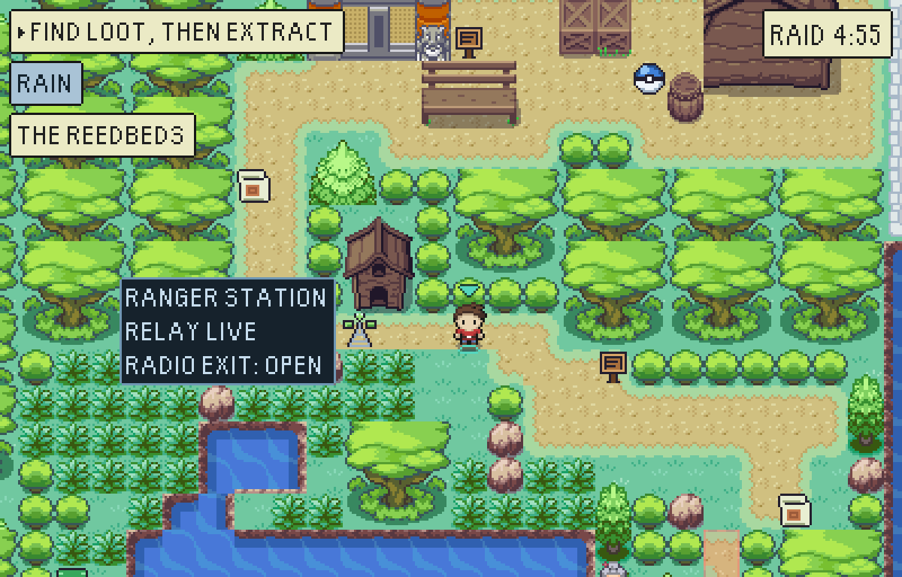
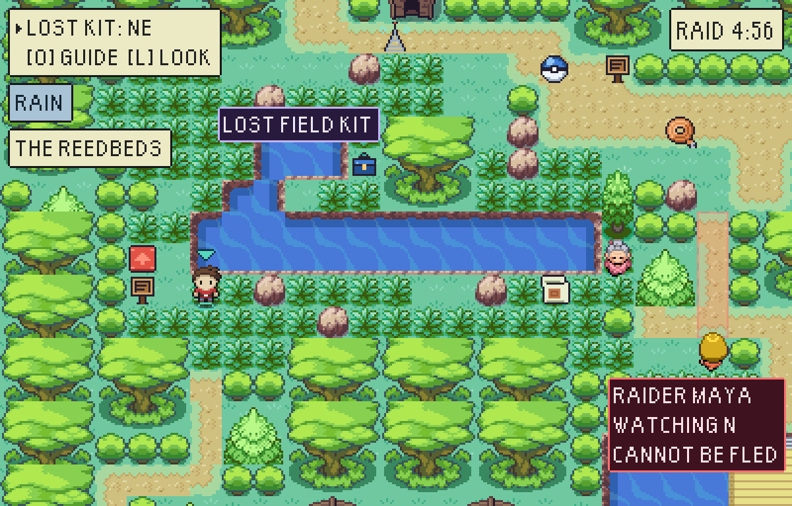
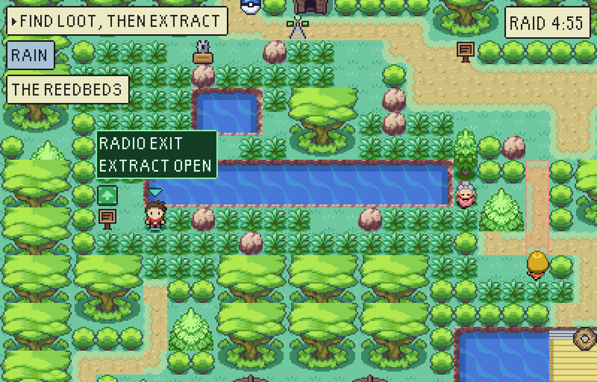
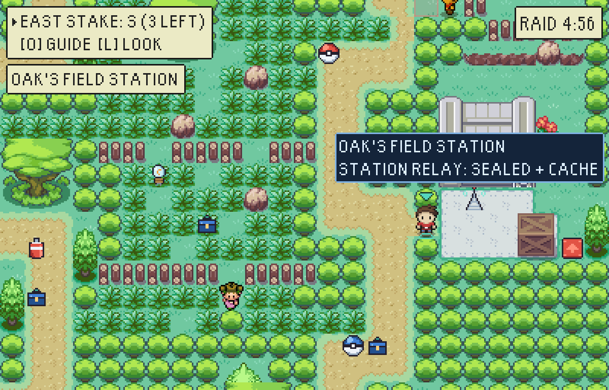
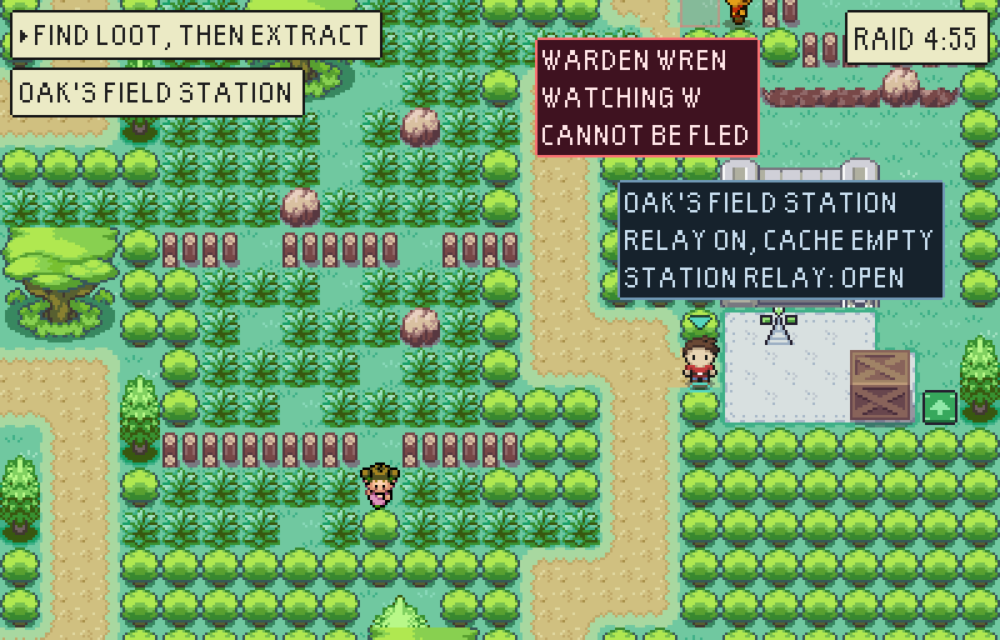
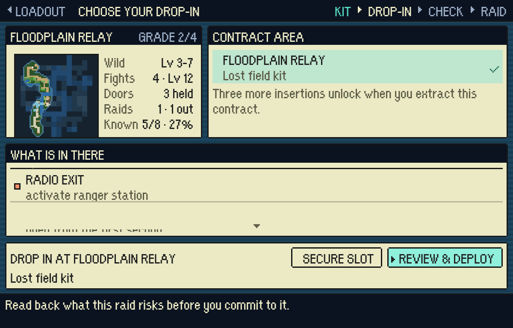
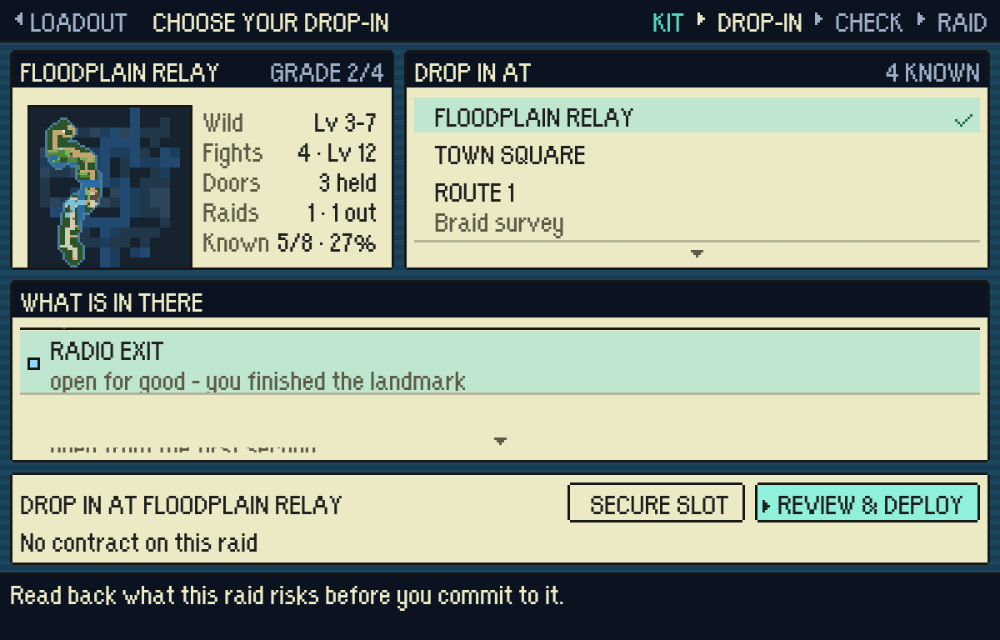
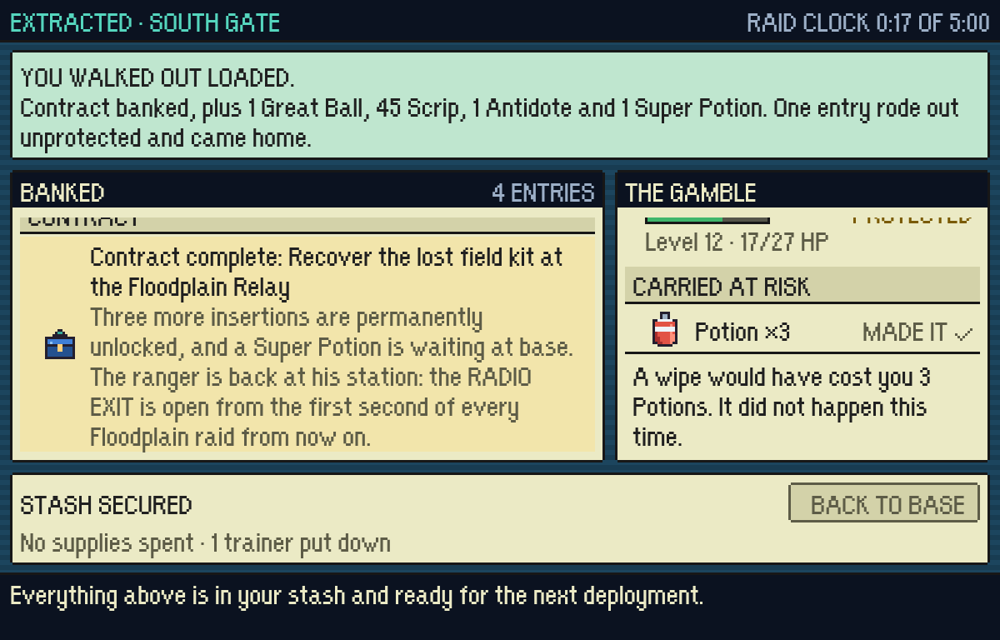

# A landmark you finished with stays finished

A contract used to unlock an insertion, pay a reward and leave no trace on the
ground it was banked on. You wound Pallet Town's Sluice Wheel and carried the
cordon ledger out through the culvert it drains; the next raid the wheel was
standing there again with the culvert sealed behind it.

`src/game/world/workedLandmarks.ts` is the rule, and it is four authored rows -
a landmark and the contract that finishes it, nothing else. The state is
**derived from `raidProgress.completedContracts` and never stored**, exactly as a
boss-held gate is derived from `defeatedBosses`.

| map | contract | landmark | what the world keeps |
|---|---|---|---|
| Floodplain Relay | Lost field kit | Ranger Station | RADIO EXIT open for good |
| Route 1 | Braid survey | Oak's Field Station | STATION RELAY open for good, **and its cache empty for good** |
| Pallet Town | Cordon ledger | Sluice Wheel | WEST CULVERT open for good |
| Viridian Forest | Warden's resupply | Fire Tower | TOWER STEPS open for good |

## It is not decoration

Every row changes a route and a risk: the way out that landmark sealed is open
from the first second of every later raid, which is a door the hunter cannot
take away. Route 1's is the one that also costs something - Oak's station is a
sealed exit *and* a standing cache of two Poké Balls and a Potion, and a station
you have finished with does not restock itself. That one is a trade.

## On the map

The landmark still stands. Taking it off would leave nothing to read the change
off, so it is drawn done instead: the `landmark-worked` icon (the same mast,
switched on), the quiet `worked` tone, and a caption saying what it *is* now
rather than what working it would open. `WorldScene.tryActivatePoiAt` refuses
it, so it neither opens what is already open nor pays out again.

Floodplain Relay, the ranger station, before and after the first contract:

The Radio Exit it seals, at the other end of the reeds - red and locked, then
green and open at 0:00:

Route 1, the one that is a trade - `RELAY ON, CACHE EMPTY`:

## At base

The lobby and the raid read the same list, so they cannot disagree. The drop-in
screen's ways out say which door is open because of something you did:

And the picture the screen leads with lights the landmark and glyphs it `K`,
the way it lights a door you opened - so coming back to base and looking at the
map shows what you changed. Route 1, before and after the braid survey
(`npx vite-node tools/tileset/minimap.mts -- route-1 out.png 8 --completed=survey-the-braid`):

The result screen says it once, on the raid that bought it:

## Played, not argued

- `node tools/playtest/raid.mjs <url> --level=12 --pack=potion:3 --completed=recover-lost-field-kit --exit=radio-exit`
  walks out through the Radio Exit at 0:07, at real speed, on a plain URL.
- the same run without `--completed` stands beside that exit for the whole five
  minutes and it never opens.
- `workedLandmarks.test.ts` holds the authored rows, a fresh save, and that the
  lobby's promise and the raid's plan are the same door.
